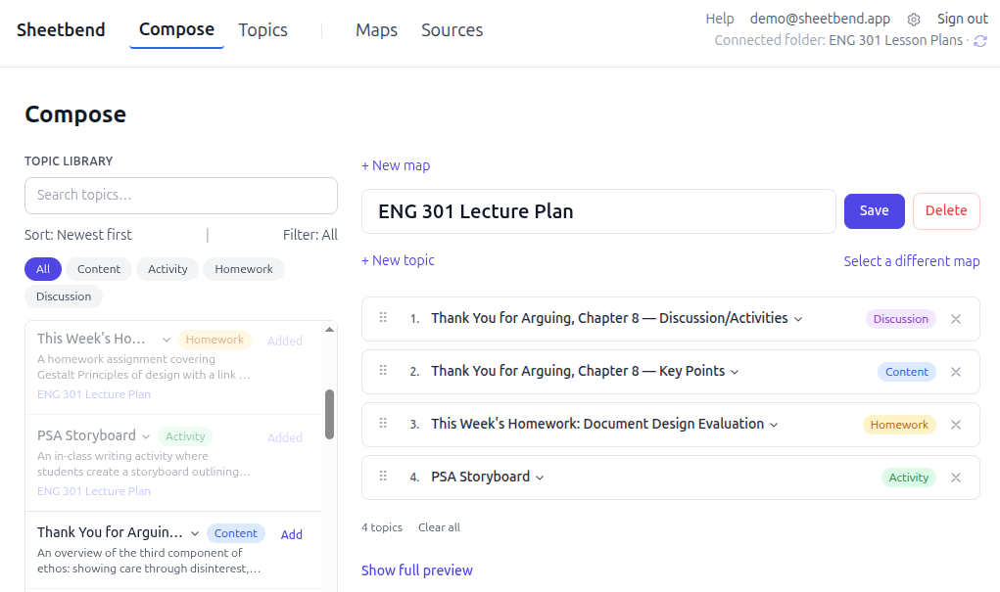

# Sheetbend

I built [sheetbend](https://sheetbend.app) to provide topic-based authoring to educators. This is a SaaS website that helps users find topics in existing Word documents, extract those topics into reusable units, and save them as Markdown. Sheetbend also provides an intuitive Markdown editor and a way to rearrange topics into different maps. Those arrangements can then be exported to PowerPoint, Word, PDF, or Markdown. 

I designed the system and built it with the help of Claude Code. I also write all of the [documentation](https://sheetbend.app/docs) and [marketing copy](https://sheetbend.app/blog) for the site. 

